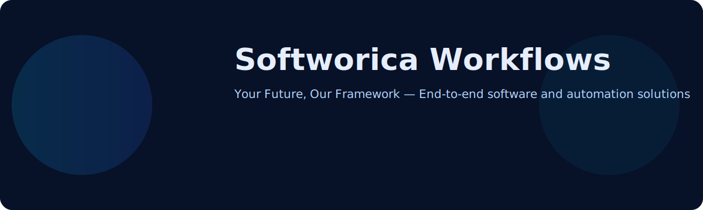

  

---

  

    <strong>🏷️ Focus</strong>
    
Web • Mobile • Cloud

  

  

    <strong>📦 Repositories</strong>
    
20+ public

  

  

    <strong>👥 Contributors</strong>
    
10+ contributors

  

  

    <strong>📈 Projects</strong>
    
30+ active

  

---

<table width="100%">
  <tr>
    <td width="60%" valign="top">
      <h2>About Us</h2>
      
Softworica Workflows is the official GitHub organization of Softworica. We design, build, and scale production-ready software — web apps, mobile apps, APIs, automation workflows, and developer tools that help businesses and teams move faster.

      
We believe in clean code, scalable architecture, automation, and continuous improvement. Our mission is to empower the digital world with technology that makes an impact.

      <h3 style="margin-top:18px">Highlights</h3>
      <ul>
        <li>End-to-end product delivery: design, build, deploy, maintain</li>
        <li>Enterprise platforms: ERP, CRM, Hospital & School systems</li>
        <li>Open-source starter kits, templates, and automation workflows</li>
        <li>Cloud-native deployments, CI/CD, and DevOps automation</li>
      </ul>
    </td>
    <td width="40%" valign="top">
      <h3>Tech Stack</h3>
      

      <h3 style="margin-top:12px">Mission & Values</h3>
      

        
 <strong>Mission</strong>
Deliver innovative digital solutions that empower businesses and developers.

        
 <strong>Vision</strong>
To be a global tech brand known for quality and innovation.

        
 <strong>Values</strong>
Quality • Integrity • Collaboration • Security

      

    </td>
  </tr>
  </table>

---

## Repository Categories

  
<strong>Web Applications</strong>
Modern responsive web apps and SaaS platforms

  
<strong>Backend & APIs</strong>
REST, GraphQL, microservices and auth.

  
<strong>Mobile Apps</strong>
Cross-platform mobile apps (React Native, Flutter).

  
<strong>Automation</strong>
GitHub Actions, CI workflows, and scripts.

  
<strong>UI Components</strong>
Reusable UI libraries and design systems.

  
<strong>Templates</strong>
Starter kits and boilerplates for fast onboarding.

---

## Featured Repositories

<table width="100%">
  <tr>
    <td style="padding:8px">
      <a href="https://github.com/SoftworicaWorkflows/softworica-crm"><strong>softworica-crm</strong></a>
      
A complete CRM system — Laravel, MySQL, modular architecture.

    </td>
    <td style="padding:8px">
      <a href="https://github.com/SoftworicaWorkflows/ecommerce-platform"><strong>ecommerce-platform</strong></a>
      
Modern e-commerce with Next.js, Tailwind and Node.js backend.

    </td>
    <td style="padding:8px">
      <a href="https://github.com/SoftworicaWorkflows/task-management-app"><strong>task-management-app</strong></a>
      
Collaborative task management — React + MongoDB.

    </td>
  </tr>
</table>

---

## GitHub Stats

  
  

---

## Contact & Connect

- 🌐 Website: https://softworica.com
- ✉️ Email: info@softworica.com
- 📘 Facebook: https://facebook.com/softworica
- 🌐 LinkedIn: https://linkedin.com/company/softworica
- ▶️ YouTube: https://youtube.com/@softworica
- 📸 Instagram: https://instagram.com/softworica

---

  
<strong>Building the Future with Technology</strong>

  
<strong>Your Future, Our Framework</strong>

  
Made with ❤️ by Softworica Workflows

